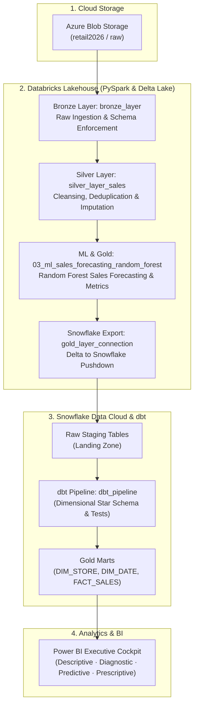

# Retail Intelligence Platform — Rossmann Store Sales

An end-to-end cloud data pipeline and retail analytics platform built on **1,115 Rossmann stores** across Germany. The system processes over **1 million daily sales transactions** to deliver executive insights on revenue trends, promotional effectiveness, competitor proximity impact, and AI-driven sales forecasting.

Built with **Azure Blob Storage**, **Azure Databricks (PySpark & Delta Lake)**, **Snowflake Data Cloud**, **dbt (data build tool)**, and **Power BI**.

---

## 🏗️ Architecture Overview

The platform implements a Medallion Architecture across cloud storage, lakehouse, warehouse, and BI layers:



---

## 📁 Repository Structure

```text
retail-intelligence/
├── azure/
│   └── dataset_link.txt                        # Dataset source link and Azure storage details
├── databricks_notebooks/
│   ├── bronze_layer.ipynb                      # Raw ingestion from Azure Blob Storage into Delta Lake
│   ├── silver_layer_sales.ipynb                # Data cleansing, missing value imputation & merging
│   ├── 03_ml_sales_forecasting_random_forest.ipynb # Random Forest sales forecasting model (Ml_model)
│   ├── gold_layer_connection.ipynb             # Feature store export & Snowflake pushdown connector
│   ├── dbt_pipeline.ipynb                      # dbt transformation orchestration notebook
│   └── README.md                               # Databricks execution guide
├── dbt_models/
│   ├── dbt_project.yml                         # dbt project configuration
│   ├── sources.yml                             # Snowflake sources & test constraints
│   ├── staging/
│   │   ├── stg_sales_clean.sql                 # Cleaned sales staging view
│   │   └── stg_store_cleaned.sql               # Store dimension staging view
│   └── gold/
│       ├── dim_store.sql                       # Store dimension table (1,115 stores)
│       ├── dim_date.sql                        # Calendar dimension with German holiday flags
│       ├── fact_sales.sql                      # Sales transaction fact table (844,338 rows)
│       ├── fact_store_closures.sql             # Store closures tracking (172,871 events)
│       └── agg_store_performance.sql           # Store-level summary & promo lift KPIs
├── snowflake/
│   ├── 01_raw_staging_tables.sql               # Database, schema, and staging table DDL
│   ├── 02_streams_and_tasks.sql                # CDC streams & automated refresh tasks
│   └── 03_data_validation_and_audit.sql        # Layer audit & zero-variance reconciliation
├── powerbi/
│   └── README.md                               # 4-page dashboard architecture & DAX formulas
├── docs/
│   ├── ARCHITECTURE.md                         # Detailed architecture specifications
│   ├── DATA_MODEL.md                           # Star schema & data dictionary
│   ├── TESTING_AND_VALIDATION.md               # 18 dbt tests & financial reconciliation
│   ├── PRESENTATION_DECK.md                    # Capstone presentation outline
│   ├── LIVE_DEMO_SCRIPT.md                     # Live demonstration walkthrough
│   ├── PROJECT_DOCUMENTATION.md                # Full project documentation report
│   ├── CODE_SNIPPETS_APPENDIX.md               # Code snippets appendix
│   └── AI_TOOL_USAGE_REPORT.md                 # AI tools documentation
├── .gitignore
└── README.md
```

---

## ⚡ Medallion Data Pipeline

### 1. Bronze Layer (Raw Ingestion)
- **Source**: Azure Blob Storage container (`retail2026/raw`).
- **Files**: `train.csv` (1,017,209 sales records), `store.csv` (1,115 store profiles), `test.csv` (41,088 evaluation records).
- **Processing Notebook**: `bronze_layer.ipynb`. Ingests raw CSVs via PySpark into raw Delta Lake format with metadata and schema validation.

### 2. Silver Layer (Cleaned & Harmonized)
- **Processing Notebook**: `silver_layer_sales.ipynb`.
- **Imputation**: Filled missing `CompetitionDistance` using median values (5,458m) and imputed missing promo flags.
- **Normalization**: Standardized date formats, encoded categorical features (`StoreType`, `Assortment`), and separated open store sales from scheduled closures.
- **Output Tables**: `silver_sales`, `silver_stores`.

### 3. Gold Layer & Machine Learning
- **Forecasting Notebook**: `03_ml_sales_forecasting_random_forest.ipynb` (`Ml_model`).
  - Algorithm: **Random Forest Regressor** (Scikit-Learn).
  - Validation Accuracy: **86.6% (0.134 RMSPE)** across 41,188 test records.
  - Forecast Output: 48-day daily store sales forecasts with confidence intervals.
- **Snowflake Pushdown Notebook**: `gold_layer_connection.ipynb`. Connects to Snowflake and writes clean Delta datasets and predictions into Snowflake `RAW` schema.
- **Dimensional Modeling**: Modeled into fact and dimension tables via **dbt** (`dbt_pipeline.ipynb`):
  - `dim_store`: Store attributes, assortment, and competition tiers.
  - `dim_date`: Calendar dates, day names, and state/school holiday indicators.
  - `fact_sales`: Transactional sales, customer footfall, and promotion flags.
  - `fact_store_closures`: Non-operational store days classified by reason (Sundays, holidays, refurbishment).

---

## 📊 Power BI Executive Dashboard

A 4-page reporting suite designed at 1080p Full HD for retail executives and store operations:

1. **Page 1: Descriptive Analytics (What Happened?)**
   - High-level KPIs: Total Revenue (€5.87B), Total Customers (644M), Average Daily Sales (€6,955).
   - Sales trends over time, store type revenue contributions, and Sunday opening impact.

2. **Page 2: Diagnostic Analytics (Why Did It Happen?)**
   - Promotional Lift analysis (+35.6% sales surge during promo campaigns).
   - Customer basket size by store format and assortment tier.
   - Competitor proximity analysis (impact of competitors within 500m).

3. **Page 3: Predictive Analytics (What Will Happen?)**
   - 48-day sales forecast generated by the Random Forest model.
   - Interactive Promotional Simulator to forecast revenue changes when adjusting promo frequency.

4. **Page 4: Prescriptive Analytics (What Should We Do?)**
   - Store priority matrix identifying at-risk and low-performing locations.
   - Targeted recommendations on staffing, inventory safety stock, and promo timing.

---

## 🔍 Data Quality & Testing

Data integrity is validated across all layers using **dbt** test suites and custom Snowflake SQL assertions:

- **18 dbt Schema Tests**: Verified `not_null`, `unique`, and `accepted_values` across primary keys and business columns.
- **Referential Integrity**: 100% foreign key matching with zero orphan records between facts and dimensions.
- **Financial Reconciliation**: Verified €0.00 discrepancy between raw ingested sales and final analytical marts across €5.873B in revenue.

---

## 🚀 How to Run

### Step 1: Azure Storage Setup
1. In your **Azure Portal**, open the Storage Account and navigate to the Blob container:
   - Container path: `retail2026/raw/`
2. Upload the raw Rossmann CSV files:
   - `train.csv` (historical sales)
   - `store.csv` (store metadata)
   - `test.csv` (future horizon test data)

### Step 2: Databricks Pipeline Execution
Run the notebooks in the Databricks workspace in the following order:

1. **Bronze Ingestion**:
   - Run `bronze_layer` (or `bronze_layer.ipynb`)
   - Mounts/reads the Azure Blob storage container and creates raw Delta Lake tables with audit timestamps.
2. **Silver Cleansing & Imputation**:
   - Run `silver_layer_sales` (or `silver_layer_sales.ipynb`)
   - Imputes missing competition distances, standardizes dates, and separates valid sales transactions from closures.
3. **Machine Learning Demand Forecasting**:
   - Run `03_ml_sales_forecasting_random_forest` (or `Ml_model`)
   - Trains the Random Forest Regressor and generates predicted sales with RMSPE evaluation.
4. **Snowflake Export**:
   - Run `gold_layer_connection` (or `gold_layer_connection.ipynb`)
   - Uses the Spark-Snowflake connector (fetching credentials from Databricks Secrets scope `retail-scope`) to load Silver and Gold datasets into Snowflake.
5. **dbt Transformation Pipeline**:
   - Run `dbt_pipeline` (or `dbt_pipeline.ipynb`)
   - Executes dbt models inside Snowflake to build the dimensional star schema marts.

### Step 3: dbt Local CLI (Alternative Execution)
If executing dbt directly via CLI:
```bash
cd dbt_models
dbt deps
dbt run
dbt test
```

### Step 4: Power BI Analytics Cockpit
1. Open `Power BI dashboard.pbix` in Power BI Desktop.
2. Configure the Snowflake connection credentials (`RETAIL_INTELLIGENCE` database, `GOLD` schema).
3. Click **Refresh Data** to populate the 4 interactive reporting pages.


---

## 👤 Done by
**Kavya Karia**  
Retail Intelligence Platform Capstone Project
