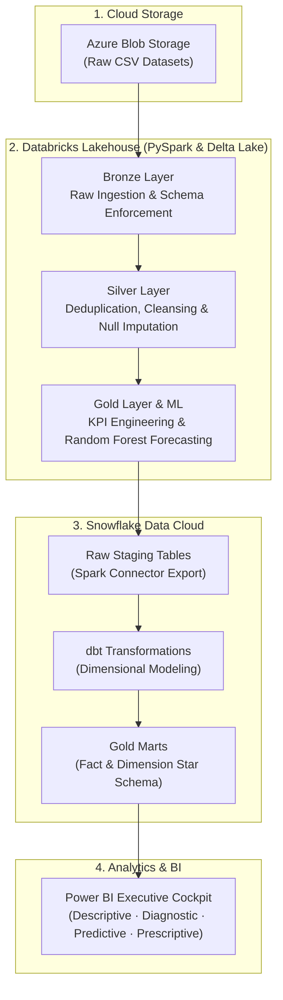

# Retail Intelligence Platform — Rossmann Store Sales

An end-to-end cloud data pipeline and retail analytics platform built on **1,115 Rossmann stores** across Germany. The system processes over **1 million daily sales transactions** to deliver executive insights on revenue trends, promotional effectiveness, competitor proximity impact, and AI-driven sales forecasting.

Built with **Azure Blob Storage**, **Azure Databricks (PySpark & Delta Lake)**, **Snowflake Data Cloud**, **dbt (data build tool)**, and **Power BI**.

---

## 🏗️ Architecture Overview

The platform implements a Medallion Architecture across cloud storage, lakehouse, warehouse, and BI layers:



---

## 📁 Repository Structure

```text
retail-intelligence/
├── azure/
│   └── dataset_link.txt                        # Dataset source link and Azure storage details
├── databricks_notebooks/
│   ├── 01_silver_cleaning_and_merging.py       # Data cleansing, missing value imputation
│   ├── 02_gold_feature_engineering_and_analytics.py # Business KPIs & competition distance tiers
│   ├── 03_ml_sales_forecasting_random_forest.py# Random Forest sales forecasting model
│   ├── 04_snowflake_export.py                  # Snowflake export connector
│   └── README.md                               # Notebook execution instructions
├── dbt_models/
│   ├── dbt_project.yml                         # dbt project configuration
│   ├── sources.yml                             # Snowflake sources & test constraints
│   ├── staging/
│   │   ├── stg_sales_clean.sql                 # Cleaned sales staging view
│   │   └── stg_store_cleaned.sql               # Store dimension staging view
│   └── gold/
│       ├── dim_store.sql                       # Store dimension table (1,115 stores)
│       ├── dim_date.sql                        # Calendar dimension with German holiday flags
│       ├── fact_sales.sql                      # Sales transaction fact table (844,338 rows)
│       ├── fact_store_closures.sql             # Store closures tracking (172,871 events)
│       └── agg_store_performance.sql           # Store-level summary & promo lift KPIs
├── snowflake/
│   ├── 01_raw_staging_tables.sql               # Database, schema, and staging table DDL
│   ├── 02_streams_and_tasks.sql                # CDC streams & automated refresh tasks
│   └── 03_data_validation_and_audit.sql        # Layer audit & zero-variance reconciliation
├── powerbi/
│   └── README.md                               # 4-page dashboard architecture & DAX formulas
├── docs/
│   ├── ARCHITECTURE.md                         # Detailed architecture specifications
│   ├── DATA_MODEL.md                           # Star schema & data dictionary
│   ├── TESTING_AND_VALIDATION.md               # 18 dbt tests & financial reconciliation
│   ├── PRESENTATION_DECK.md                    # Capstone presentation outline
│   ├── LIVE_DEMO_SCRIPT.md                     # Live demonstration walkthrough
│   ├── PROJECT_DOCUMENTATION.md                # Full project documentation report
│   ├── CODE_SNIPPETS_APPENDIX.md               # Code snippets appendix
│   └── AI_TOOL_USAGE_REPORT.md                 # AI tools documentation
├── .gitignore
└── README.md
```

---

## ⚡ Medallion Data Pipeline

### 1. Bronze Layer (Raw Ingestion)
- **Source**: Azure Blob Storage (`retail2026/raw`).
- **Files**: `train.csv` (1,017,209 sales records), `store.csv` (1,115 store profiles), `test.csv` (41,088 evaluation records).
- **Processing**: Ingested via PySpark with explicit schema definitions and audit timestamps.

### 2. Silver Layer (Cleaned & Harmonized)
- **Imputation**: Filled missing `CompetitionDistance` using median values (5,458m) and imputed missing promo flags.
- **Normalization**: Standardized date formats, encoded categorical features (`StoreType`, `Assortment`), and separated open store sales from scheduled closures.
- **Output Tables**: `silver_sales`, `silver_stores`.

### 3. Gold Layer (Analytical Modeling & ML)
- **Star Schema**: Modeled into fact and dimension tables via **dbt** inside **Snowflake**:
  - `dim_store`: Store attributes, assortment, and competition tiers.
  - `dim_date`: Calendar dates, day names, and state/school holiday indicators.
  - `fact_sales`: Transactional sales, customer footfall, and promotion flags.
  - `fact_store_closures`: Non-operational store days classified by reason (Sundays, holidays, refurbishment).
- **Machine Learning**:
  - Algorithm: **Random Forest Regressor** (Scikit-Learn).
  - Validation Accuracy: **86.6% (0.134 RMSPE)** across 41,188 test records.
  - Forecast Output: 48-day daily store sales forecasts with confidence intervals.

---

## 📊 Power BI Executive Dashboard

A 4-page reporting suite designed at 1080p Full HD for retail executives and store operations:

1. **Page 1: Descriptive Analytics (What Happened?)**
   - High-level KPIs: Total Revenue (€5.87B), Total Customers (644M), Average Daily Sales (€6,955).
   - Sales trends over time, store type revenue contributions, and Sunday opening impact.

2. **Page 2: Diagnostic Analytics (Why Did It Happen?)**
   - Promotional Lift analysis (+35.6% sales surge during promo campaigns).
   - Customer basket size by store format and assortment tier.
   - Competitor proximity analysis (impact of competitors within 500m).

3. **Page 3: Predictive Analytics (What Will Happen?)**
   - 48-day sales forecast generated by the Random Forest model.
   - Interactive Promotional Simulator to forecast revenue changes when adjusting promo frequency.

4. **Page 4: Prescriptive Analytics (What Should We Do?)**
   - Store priority matrix identifying at-risk and low-performing locations.
   - Targeted recommendations on staffing, inventory safety stock, and promo timing.

---

## 🔍 Data Quality & Testing

Data integrity is validated across all layers using **dbt** test suites and custom Snowflake SQL assertions:

- **18 dbt Schema Tests**: Verified `not_null`, `unique`, and `accepted_values` across primary keys and business columns.
- **Referential Integrity**: 100% foreign key matching with zero orphan records between facts and dimensions.
- **Financial Reconciliation**: Verified €0.00 discrepancy between raw ingested sales and final analytical marts across €5.873B in revenue.

---

## 🚀 How to Run

1. **Databricks Processing**:
   - Run `01_silver_cleaning_and_merging.py` to clean and standardize raw data.
   - Run `02_gold_feature_engineering_and_analytics.py` to create analytical features.
   - Run `03_ml_sales_forecasting_random_forest.py` to train the model and generate predictions.
   - Run `04_snowflake_export.py` to load data into Snowflake.

2. **dbt Transformation**:
   ```bash
   cd dbt_models
   dbt deps
   dbt run
   dbt test
   ```

3. **Power BI**:
   - Open `Power BI dashboard.pbix`.
   - Connect to your Snowflake database.
   - Refresh to update the dashboard pages.


---

## 👤 Author
**Kavya Karia**   
Retail Intelligence Platform Capstone Project
